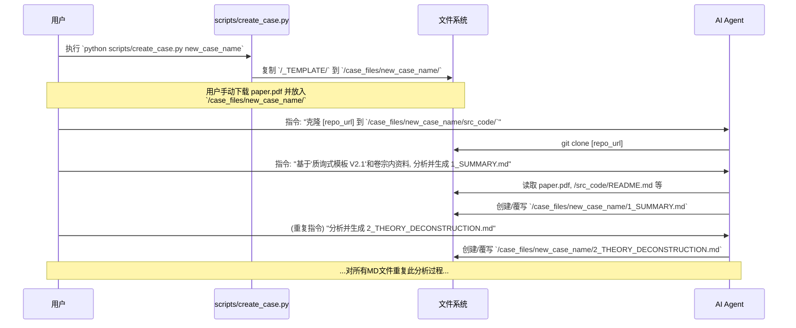
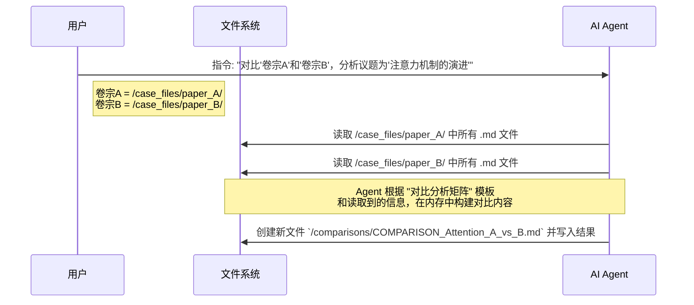
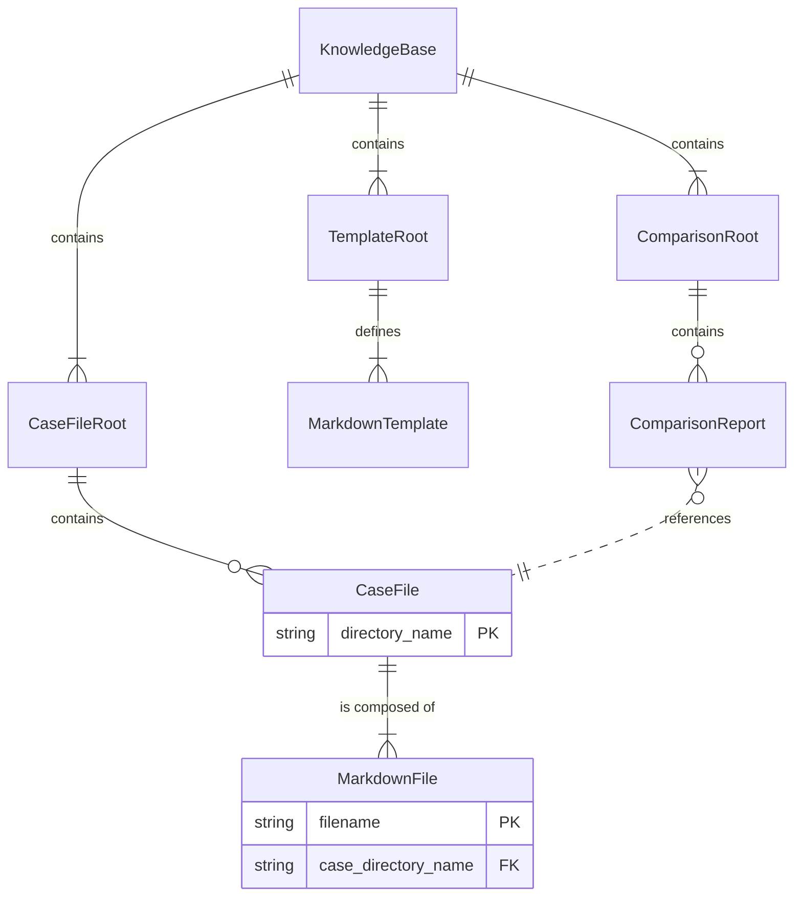

好的，非常感谢您的澄清。我完全理解了，是我之前的理解有误。我们设计的核心不是一个软
# **个人技术知识引擎 - V1.0 详细设计文档 (LLD)**

## 项目结构与总体设计

本系统是一个基于文件系统的结构化知识库。它的核心资产是遵循严格规范的**“卷宗 (Case Files)”** 目录和**“对比报告 (Comparison Reports)”** 文件。

系统的设计哲学是**“结构即系统 (Structure as System)”**。我们不构建复杂的软件，而是定义一个清晰、可扩展的目录蓝图和一套标准化的操作流程。这套流程将由**用户**主导，并由**AI Agent**（或自动化脚本）辅助执行，以确保分析的深度和一致性。

**核心工作流程分为两种：**

1.  **深度分析 (Deep Dive):** 用户选定一篇论文，通过一系列标准化步骤（创建目录、下载资料、指令Agent分析），生成一个完整的“卷宗”。
2.  **横向对比 (Comparison):** 用户选定多个已完成的“卷宗”，指令Agent对它们进行多维度对比，生成一份结构化的对比报告。

## 目录结构树 (Directory Tree)

这是整个知识引擎的根目录结构。它清晰地将模板、所有卷宗和所有对比报告分离开来，便于管理。

```
/personal_knowledge_engine
|
|-- README.md                     # 项目说明，包含核心原则和工作流
|
|-- /_TEMPLATE/                   # 所有分析模板的源头 (只读)
|   |-- 1_SUMMARY.md
|   |-- 2_THEORY_DECONSTRUCTION.md
|   |-- 3_ENGINEERING_ANALYSIS.md
|   |-- 4_CRITIQUE_AND_REFLECTION.md
|
|-- /case_files/                  # 存放所有独立技术分析“卷宗”的根目录
|   |-- /swin_transformer_v1/     # 单个“卷宗”的示例
|   |   |-- paper.pdf
|   |   |-- /src_code/            # 对应的代码库
|   |   |-- 1_SUMMARY.md
|   |   |-- 2_THEORY_DECONSTRUCTION.md
|   |   |-- 3_ENGINEERING_ANALYSIS.md
|   |   |-- 4_CRITIQUE_AND_REFLECTION.md
|   |-- /another_paper_name/
|   |   |-- ...
|
|-- /comparisons/                 # 存放所有横向对比报告的根目录
|   |-- COMPARISON_ViT_vs_Swin.md # 单个对比报告的示例
|
|-- /scripts/                     # 存放辅助自动化脚本的目录
|   |-- create_case.py            # 用于快速创建新“卷宗”目录结构的脚本
```

## 整体逻辑和交互时序图

### 流程一：深度分析 (Deep Dive Workflow)

此流程描述了如何从零开始创建一个新的技术“卷宗”。



### 流程二：横向对比 (Comparative Analysis Workflow)

此流程描述了在拥有多个“卷宗”后，如何生成一份对比报告。



## 数据实体结构深化

本系统的核心是文件和目录的组织关系。



## 配置项

V1.0版本中，本知识库结构本身无配置项。

但执行流程中的 **AI Agent** 可能需要配置，例如：
*   **环境变量:** `OPENAI_API_KEY` 或其他LLM提供商的API密钥。
这部分配置由Agent的使用方负责，不属于本知识库结构的一部分。

## 模块化文件详解 (File-by-File Breakdown)

### `/_TEMPLATE/*.md` (所有模板文件)

a. **文件用途说明**

这些文件是所有分析工作的**“质询式”蓝图**。它们定义了每个分析文档必须回答的核心问题，确保了分析的**一致性、深度和可验证性**。Agent在生成报告时，必须严格遵循这些模板的结构和“质询”要求。

b. **文件内容规范**

*   **`1_SUMMARY.md`**: 定义了对技术进行高层概括的框架，包括核心思想、贡献和个人初步评级。
*   **`2_THEORY_DECONSTRUCTION.md`**: 聚焦理论层，要求Agent通过引用、图表复现、公式解释等方式，精确拆解其方法论。
*   **`3_ENGINEERING_ANALYSIS.md`**: 聚焦工程实现，要求Agent将理论创新点与具体代码实现进行映射，并进行静态的性能和依赖分析。
*   **`4_CRITIQUE_AND_REFLECTION.md`**: 聚焦批判性思维，要求Agent识别论文的局限性、寻找后续改进工作，并总结对个人的启发。

---

### `/scripts/create_case.py`

a. **文件用途说明**

一个简单的、无依赖的Python脚本，其唯一目的是**自动化创建新“卷宗”的目录结构**。它将 `_TEMPLATE` 目录的内容复制到 `/case_files/` 下的一个新目录中，为后续的分析工作做好准备。

b. **文件内类图 (Mermaid `classDiagram`)**

*此文件不包含任何类。*

c. **函数/方法详解**

#### 函数/方法详解: `create_new_case(case_name: str)`

-   **用途:** 创建一个标准的新“卷宗”目录。
-   **输入参数:**
    -   `case_name` (str): 新卷宗的名称 (例如: `swin_transformer_v1`)。
-   **输出数据结构:** 无。副作用是在文件系统 `/case_files/` 目录下创建一个新目录。
-   **实现流程和要点:**

```mermaid
flowchart TD
    A[开始] --> B[接收 case_name 参数];
    B --> C[定义源路径: _TEMPLATE];
    C --> D[定义目标路径: case_files/{case_name}];
    D --> E{目标路径是否已存在?};
    E -- 是 --> F[打印错误信息并退出];
    E -- 否 --> G[使用 shutil.copytree 复制源到目标];
    G --> H[创建空的 'src_code' 子目录];
    H --> I[创建空的 'paper.pdf' 占位文件];
    I --> J[打印成功信息];
    J --> K[结束];
```

## 迭代演进依据

这份基于文件系统的设计具有极强的迭代演进能力：

1.  **分析维度可扩展:** 当需要增加新的分析维度时（例如，“部署可行性分析”），只需在 `_TEMPLATE` 目录中增加一个新的 `5_DEPLOYMENT_ANALYSIS.md` 文件，并更新 `create_case.py` 脚本即可。现有所有“卷宗”不受任何影响。
2.  **流程自动化可渐进增强:** `/scripts/` 目录是所有自动化工具的家。当前只有一个简单的创建脚本。未来可以逐步增加更强大的脚本，例如：
    *   `git_clone.py`: 自动根据用户输入克隆代码库。
    *   `validate_case.py`: 检查一个“卷宗”是否包含了所有必需的文件。
    *   `auto_fill.py`: 尝试使用Agent自动填充部分简单的、模式化的内容（如论文基本信息）。
3.  **结构稳定，内容可变:** 核心的目录结构 (`/case_files`, `/comparisons`) 非常稳定。这使得我们可以随时更新 `_TEMPLATE` 的内容（例如，改进某个“质询”问题），而不会破坏整个知识库的结构。
4.  **与工具解耦:** 知识库本身是纯文本和目录，不依赖任何特定软件。用户可以使用VSCode, Obsidian, 或任何文本编辑器来查看和编辑。Agent可以是任何具备代码执行和文件I/O能力的LLM，更换Agent不会影响知识库。